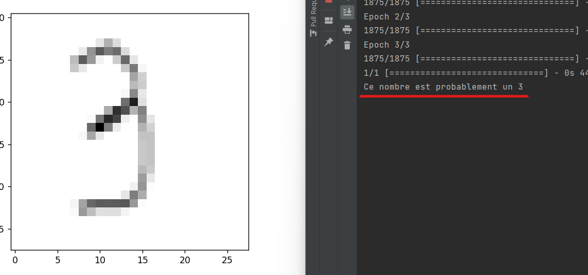

# Handwritten Digit Recognition

Ce projet implémente une solution de reconnaissance de chiffres manuscrits en utilisant le jeu de données MNIST et un modèle de réseau neuronal à plusieurs couches avec TensorFlow et OpenCV.

## Prérequis

- Python 3.8
- Bibliothèques Python : numpy, matplotlib, tensorflow, opencv-python

## Installation

1. Clonez le dépôt GitHub :

    ```bash
    git clone https://github.com/wooliestchain/dp.git
    cd dp
    ```

2. Installez les dépendances :

    ```bash
    pip install tensorflow
    pip install numpy
    pip install matplotlib
    pip install opencv-python
    ```

## Entraînement du Modèle
    ```bash
    model.fit(x_train, y_train,epochs=3)
    model.save('handwritten.model')
    model = tf.keras.models.load_model('handwritten.model')
    ```


## Utilisation

2. Exécutez le script de reconnaissance des chiffres manuscrits.
    ```bash
    image_number = 1
    while os.path.isfile(f"digits/ex{image_number}.png"):
    try:
        img = cv2.imread(f"digits/ex{image_number}.png")[:,:,0]
        img = np.invert(np.array([img]))
        prediction = model.predict(img)
        print(f"Ce nombhre est probablement un {np.argmax(prediction)} ")
        plt.imshow(img[0], cmap=plt.cm.binary)
        plt.show()
    except:
        print("Error")
    finally:
        image_number += 1
    ```

    Le script parcourt les fichiers d'images dans le répertoire `digits/` et affiche les prédictions du modèle.

## Exemple



## Auteur

- Emmanuel Levy MBINA


